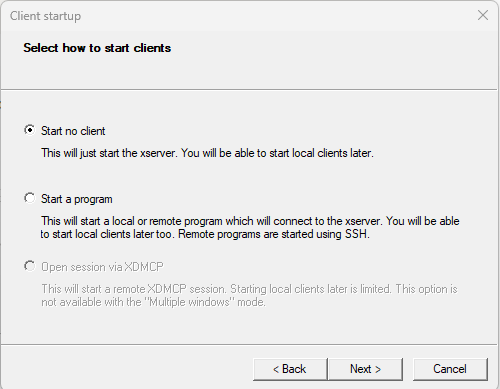

# Fuxlastix-docker
This is a Docker container for Fuxlastix. 

Please find more details regarding Fuxlastix here [https://github.com/xPITcoding/Fuxlastix](https://github.com/xPITcoding/Fuxlastix)

All rights regarding fuxlastix is reserved by xPit UMG Goettingen.   


# Running Fuxlastix Docker Container

---

# Linux:

### 1. Docker Installation:

Install docker on your Linux machine.

---

Follow the official description. [https://docs.docker.com/engine/install/](https://docs.docker.com/engine/install/)

<aside>
💡 After installing docker you might need to run the docker daemon manually. To do that run the following command

</aside>

```bash
sudo systemctl start docker
```

Please refer to this link for more details 

[Start the daemon](https://docs.docker.com/config/daemon/start/)

<aside>
💡 If you get permission issue then run the commands with sudo

</aside>

### 2. Download Fuxlastix

Download the Fuxlastix docker image from docker hub. Run the following command to pull the Fuxlastix docker image.

```bash
docker pull mmrsagar/fuxlastix:v1.0.2
```

For latest version check the following link : [https://hub.docker.com/r/mmrsagar/fuxlastix/tags](https://hub.docker.com/r/mmrsagar/fuxlastix/tags)

After download is completed check the available images by running the following command.

```bash
docker images 
```

### 3. Run the Fuxlastix image

To run the Fuxlastix image run the following command. 

First we need to disable the access contron in the host machine so that it allows external display to be connected. For that run 

```bash
xhost +
```

You will get a message that access control disabled, clients can connect from any host

---

Then run the following command to run the Fuxlastix image 

```bash
docker run --rm -v $(pwd):/host -it --name fuxlastix -e DISPLAY=$DISPLAY -v /tmp/.X11-unix:/tmp/.X11-unix:ro mmrsagar/fuxlastix:v1.0.2
```

 --rm : this is to remove the container after it finishes running.

-v : is to map the host directory to the client(running container)

-it : interactive 

--name : name of the container 

-e : setting environment variable

-v: accessing a unix display port as of read-only(ro) mode

last command is the name and tag of the image that we want to run. 

### 4. Open Fuxlastix
Run the following command to open the Fuxlastix GUI application. 

```bash
/app/fuxlastix-Lin/build-Fuxlastix-Desktop-Debug/Fuxlastix
```

### 5. Closing the container

To close the running container use “exit” command on the running container. Otherwise next run will conflict with the previous run. 

After exiting the container run “xhost -” on the host machine to enable the access control again. 

# Windows:

### 1. Docker Installation:

Install docker on your windows machine.

---

Follow the official description. [https://docs.docker.com/desktop/install/windows-install/](https://docs.docker.com/desktop/install/windows-install/)

### 2. Download Fuxlastix

Download the Fuxlastix docker image from docker hub. Run the following command to pull the Fuxlastix docker image.

```bash
docker pull mmrsagar/fuxlastix:v1.0.2
```

For latest version check the following link : [https://hub.docker.com/r/mmrsagar/fuxlastix/tags](https://hub.docker.com/r/mmrsagar/fuxlastix/tags)

After download is completed check the available images by running the following command.

```bash
docker images 
```

### 3. Run the Fuxlastix image

To run an GUI application from a docker container in windows we need a xserver on the host windows machine then we can forward the display port from the container to the host machine. There are different application that can do the job. 

- Download and install xserver for windows.

You can download the xserver from the following link. [https://sourceforge.net/projects/vcxsrv/](https://sourceforge.net/projects/vcxsrv/)

After installation run the XLaunch app 


select multiple display and press Next



select Start no-client and press Next


leave the setting as above and Next


press Finish to complete the process

Now the xserver is running in the background of windows host machine and this will allow displays from any client. 

---

Then run the following command to run the Fuxlastix image 

```bash
docker run --rm -v %cd%:/host -it --name fuxlastix -e DISPLAY=host.docker.internal:0.0 mmrsagar/fuxlastix:v1.0.2
```

 --rm : this is to remove the container after it finishes running.

-v : is to map the host directory to the client(running container)

-it : interactive 

--name : name of the container 

-e : setting environment variable

-v: accessing a unix display port as of read-only(ro) mode

last command is the name and tag of the image that we want to run. 

### 4. Open Fuxlastix
Run the following command to open the Fuxlastix GUI application. 

```bash
/app/fuxlastix-Lin/build-Fuxlastix-Desktop-Debug/Fuxlastix
```

### 5. Closing the container

To close the running container use “exit” command on the running container. Otherwise next run will conflict with the previous run. 

After exiting the container you can also close the XLunch application from the task bar. 

# Mac:

### 1. Docker Installation:

Install docker on your MAC.

---

Follow the official description. [https://docs.docker.com/desktop/install/mac-install/](https://docs.docker.com/desktop/install/mac-install/)

### 2. Download Fuxlastix

Download the Fuxlastix docker image from docker hub. Run the following command to pull the Fuxlastix docker image.

```bash
docker pull mmrsagar/fuxlastix:v1.0.2
```

For latest version check the following link : [https://hub.docker.com/r/mmrsagar/fuxlastix/tags](https://hub.docker.com/r/mmrsagar/fuxlastix/tags)

After download is completed check the available images by running the following command.

```bash
docker images 
```

<aside>
💡 Before running make sure that docker desktop is running

</aside>

### 3. Run the Fuxlastix image

To run an GUI application from a docker container in mac we need a XQuartz on the host machine then we can forward the display port from the container to the host machine.

- Download and install XQuartz.

You can download the XQuartz from the following link. [https://www.xquartz.org/](https://www.xquartz.org/)

After installation run the XQuartz app. 

Then we need to disable the access contron in the host machine so that it allows external display to be connected. For that run 

```bash
xhost +
```

You will get a message that access control disabled, clients can connect from any host

---

Then run the following command to run the Fuxlastix image 

```bash
docker run --rm -v $(pwd):/host -it --name fuxlastix -e DISPLAY=host.docker.internal:0 -v /tmp/.X11-unix:/tmp/.X11-unix mmrsagar/fuxlastix:v1.0.2
```

 --rm : this is to remove the container after it finishes running.

-v : is to map the host directory to the client(running container)

-it : interactive 

--name : name of the container 

-e : setting environment variable

-v: accessing a unix display port as of read-only(ro) mode

last command is the name and tag of the image that we want to run. 

### 4. Open Fuxlastix
Run the following command to open the Fuxlastix GUI application. 

```bash
/app/fuxlastix-Lin/build-Fuxlastix-Desktop-Debug/Fuxlastix
```

### 5. Closing the container

To close the running container use “exit” command on the running container. Otherwise, next run will conflict with the previous run. 

After exiting the container run “xhost -” on the host machine to enable the access control again.
